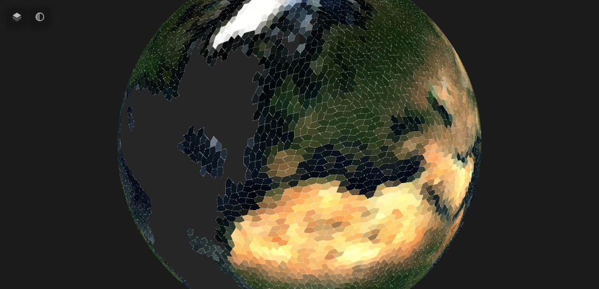

<!-- README.md is generated from README.Rmd. Please edit that file -->

# a5px

<!-- badges: start -->

[](https://lifecycle.r-lib.org/articles/stages.html#experimental)
[](https://www.apache.org/licenses/LICENSE-2.0)
[](https://github.com/belian-earth/a5px/actions/workflows/R-CMD-check.yaml)
[](https://app.codecov.io/gh/belian-earth/a5px)
[](https://extendr.github.io/extendr/extendr_api/)
<!-- badges: end -->

a5px is a Rust-backed R package that streams GeoTIFF / Cloud-Optimised
GeoTIFF rasters from local files or cloud object stores and aggregates
their pixels into [A5 pentagonal DGGS](https://a5geo.org/) cells in a
single pass.

The output is a tibble (or Arrow table, or Parquet file on disk) keyed
by `a5R::a5_cell`, ready for SQL-style queries against the resulting
embeddings or summary statistics. On a 12-band Sentinel-2 COG it is
roughly **7x faster** than `gdal raster zonal-stats` end-to-end and
**11x faster** than a hand-rolled `terra + dplyr` pipeline.

## Installation

a5px is not on CRAN. Install the development version from GitHub:

``` r
# install.packages("pak")
pak::pak("belian-earth/a5px")
```

You will need a working [Rust toolchain](https://rustup.rs/) (`cargo`
and `rustc` \>= 1.85) and a recent version of
[`a5R`](https://github.com/belian-earth/a5R) in your library.

## Quick example

A complete read of a public Cloud-Optimised GeoTIFF into A5 cells, then
a quick visualisation. Here the source is an [Alpha Earth
Foundations](https://source.coop/tge-labs/aef) embedding tile (64 Int8
bands, 10 m, UTM 36S over Malawi); we take the first three embedding
dimensions and render them as false-colour RGB. Because `stat = "mean"`,
`a5_read_raster()` reads the coarsest COG overview that still
oversamples each A5 cell, so the whole 2.7 GB tile resolves to ~900
cells in a couple of seconds.

``` r
library(a5px)
#> Loading required package: a5R


url <- paste0(
  "https://data.source.coop/tge-labs/aef/v1/annual/2021/36S/",
  "xekh5rjs4wg6wb9b4-0000000000-0000000000.tiff"
)


aef <- a5_read_raster(
  url,
  resolution     = 15L,
  bands          = 11:13,
  stat           = "mean"
)

aef
#> # A tibble: 213,007 × 4
#>    cell                A10     A11    A12
#>    <a5_cell>         <dbl>   <dbl>  <dbl>
#>  1 4866e648e0000000 -15.8  -20.7   -20.0 
#>  2 4a99f9a820000000  -2.95  -0.737   5.26
#>  3 486664a520000000  14.2  -43.6   -39.2 
#>  4 48664c23e0000000 -20.8  -48.1   -38.8 
#>  5 4a9965cd60000000 -18.5   -6.32   29.9 
#>  6 4a999f75e0000000   2.86 -40.6   -37.9 
#>  7 4a99b3c520000000  44.4  -27     -33.6 
#>  8 4866d89720000000  13.1  -37.3   -37.6 
#>  9 4a9994bda0000000   6    -38.8   -31.1 
#> 10 486659d8e0000000  26.8  -35.6   -41.1 
#> # ℹ 212,997 more rows

# Render the three embedding bands as false-colour RGB on the globe

a5view::a5_view(aef,
                fill = a5view::cells_rgb(A10, A11, A12),
                opacity = 1,
                zoom = 9,
                fill_identity = TRUE,
                border = NULL)
```



## API surface

### Three reader entry points, same engine

``` r
# 1. tibble path: one numeric column per band, easy R interactivity
tbl <- a5_read_raster(src, resolution, stat, bands, threads, io_concurrency,
                      as_vector = FALSE)

# 2. arrow Table path: cell + FixedSizeList<float, n_bands> value column
arr <- a5_read_raster_arrow(src, resolution, stat, bands, threads,
                            io_concurrency, value_type = "float64")

# 3. Rust-direct Parquet path: skips the R-side Arrow round-trip entirely
a5_raster_to_parquet(src, dest, resolution, stat, bands, value_type,
                     compression, threads, io_concurrency)

# Convenience writer for either (1) or (2)
a5_write_parquet(x, dest, compression = "zstd", ...)
```

All three readers share the same arguments:

- `src` — path or URL. Schemes: local, `file://`, `http(s)://`, `s3://`,
  `gs://`, `az://`. Cloud reads stream byte ranges; the full file is
  never materialised.
- `resolution` — A5 resolution (0–30); see `a5R::a5_cell_area()`.
- `stat` — one or more of `"mean"`, `"sum"`, `"count"`, `"min"`,
  `"max"`. A vector emits one column per (band, stat) pair on the tibble
  path and one FixedSizeList per stat on the Arrow / Parquet paths.
- `bands` — `NULL` (all), integer indices (1-based), or character band
  names matched against the GDAL `DESCRIPTION` tag.
- `threads`, `io_concurrency` — tile-level concurrency.

### Multi-stat in one pass

``` r
# sum and count let you merge multi-tile aggregates without re-reading
agg <- a5_read_raster(src, resolution = 14L,
                      stat = c("mean", "sum", "count"))
# columns: cell, B02__mean, B02__sum, B02__count, B03__mean, ...
```

### Pre-aggregation dequantization

Quantized sources must be decoded per pixel *before* aggregation: a
nonlinear decode does not commute with the mean, so averaging raw int8
codes and decoding the result gives the wrong answer. `dequant` applies
the decode on the Rust side, ahead of the accumulators:

``` r
# Alpha Earth Foundations int8 codes: sign(x) * (x / 127.5)^2
emb <- a5_read_raster(url, resolution = 14L, bands = 1:8, dequant = dequant_aef)

# or any vectorised R function over the integer code domain
emb <- a5_read_raster(url, resolution = 14L, dequant = function(x) x / 250)
```

Arbitrary R functions work because the code domain is finite: the
function is evaluated once over all possible codes and shipped to Rust
as a lookup table. This restricts `dequant` to integer sources of 16
bits or fewer (int8 / uint8 / int16 / uint16), which is what “quantized”
means in practice. NoData is matched against the raw code before
decoding.

Setting `dequant` also flips the `use_overviews` default to `FALSE`: COG
overviews are typically average-resampled, and an overview pixel that is
a mean of quantized codes decodes incorrectly. Pass
`use_overviews = TRUE` explicitly (it warns) only when the source’s
overviews were built with nearest or mode resampling.

### Overlay sampling

The default forward mode assigns each pixel wholly to the cell
containing its centre. `mode = "overlay"` instead weights each pixel’s
contribution by the fraction of its area inside each cell it overlaps,
approximated by sub-pixel supersampling (`subsamples`, auto-selected by
default):

``` r
# area-weighted mean (boundary pixels apportioned, not all-or-nothing)
a5_read_raster(src, resolution = 12L, mode = "overlay")

# mass-preserving sum: totals (e.g. population counts) are conserved
a5_read_raster(src, resolution = 12L, mode = "overlay", stat = "sum")
```

Pixels interior to a cell take a fast path costing the same as forward
mode; only pixels straddling a cell boundary pay the supersampling cost.

### Categorical rasters

For integer rasters whose values are class labels (land cover, masks),
`stat = "majority"` gives each cell’s dominant class and
`stat = "fractions"` gives per-class shares as a list-column. Under
`mode = "overlay"` both are area-weighted:

``` r
a5_read_raster(landcover, resolution = 12L, stat = "majority", mode = "overlay")
a5_read_raster(landcover, resolution = 12L, stat = "fractions")
```

### Band selection on the wire

For planar (`INTERLEAVE=BAND`) COGs — common in embedding rasters like
Alpha Earth Foundations — requesting `bands = 1:8` only fetches the byte
ranges of those bands. Reading 8 of 64 bands from a 2.8 GB AEF tile
drops from 62 s to 24 s end-to-end.

``` r
url <- "https://data.source.coop/.../tile.tiff"
a5_raster_to_parquet(
  url, "embeddings.parquet",
  resolution     = 14L,
  bands          = 1:8,
  value_type     = "float32",
  compression    = "zstd",
  threads        = 16L,
  io_concurrency = 16L
)
```

### Configuration

``` r
a5px_set_threads(8)                  # global default
a5px_get_threads()                   # current
options(a5px.threads = 8)            # picked up at .onLoad
Sys.setenv(A5PX_NUM_THREADS = "8")   # ditto
Sys.setenv(A5PX_PROFILE = "1")       # dump stage timings to stderr
```

## What’s supported

- **Formats** — tiled GeoTIFF and Cloud-Optimised GeoTIFF, ZSTD /
  Deflate / LZW / JPEG / uncompressed.
- **CRS resolution** — EPSG codes, WKT in citation fields, and
  reconstruction from explicit GeoKey parameters. Custom centered
  projections written by GDAL (`+proj=laea +lon_0=... +lat_0=...`,
  Albers, LCC, polar stereographic, etc.) are recognised without needing
  an EPSG number.
- **NoData** — dataset-wide `TIFFTAG_GDAL_NODATA` is honoured with
  NaN-safe comparison.

## Not yet supported

- Strip-based GeoTIFFs (errors with a clear message).
- Per-band nodata — a GeoTIFF spec limitation; will land with VRT
  support.
- Inverse / cell-driven mode for `pixel_area > cell_area`.
- Antimeridian-crossing rasters.

## Stack

- [`async-tiff`](https://crates.io/crates/async-tiff) +
  [`object_store`](https://crates.io/crates/object_store) for streamed
  reads.
- [`proj4rs`](https://crates.io/crates/proj4rs) for pure-Rust CRS
  reprojection; [`proj4wkt`](https://crates.io/crates/proj4wkt) for the
  WKT-only fallback.
- [`a5`](https://crates.io/crates/a5) for cell math.
- [`arrow-array`](https://crates.io/crates/arrow-array) +
  [`parquet`](https://crates.io/crates/parquet) for the Rust-direct
  Parquet writer.
- [`extendr-api`](https://extendr.rs/extendr/extendr_api/) for the R
  bindings.

## Acknowledgements

Built on the [a5 Rust crate](https://github.com/felixpalmer/a5-rs) by
[Felix Palmer](https://github.com/felixpalmer) and
[`a5R`](https://github.com/belian-earth/a5R) for the cell type and Arrow
interop. Streaming I/O and TIFF parsing courtesy of the
[`async-tiff`](https://github.com/developmentseed/async-tiff) team at
Development Seed.
